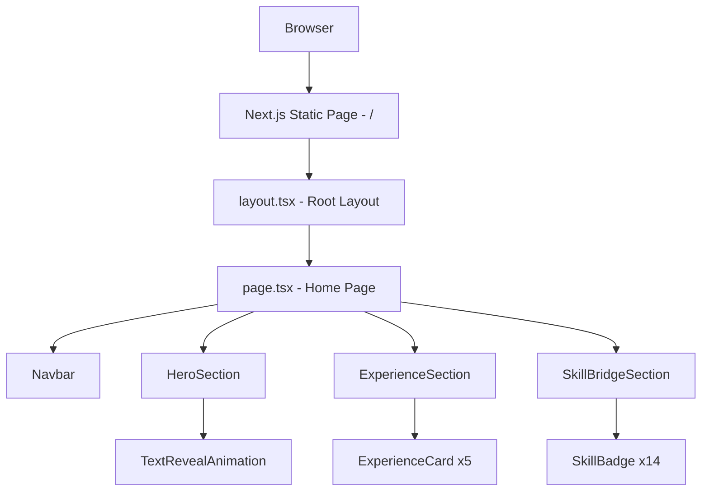
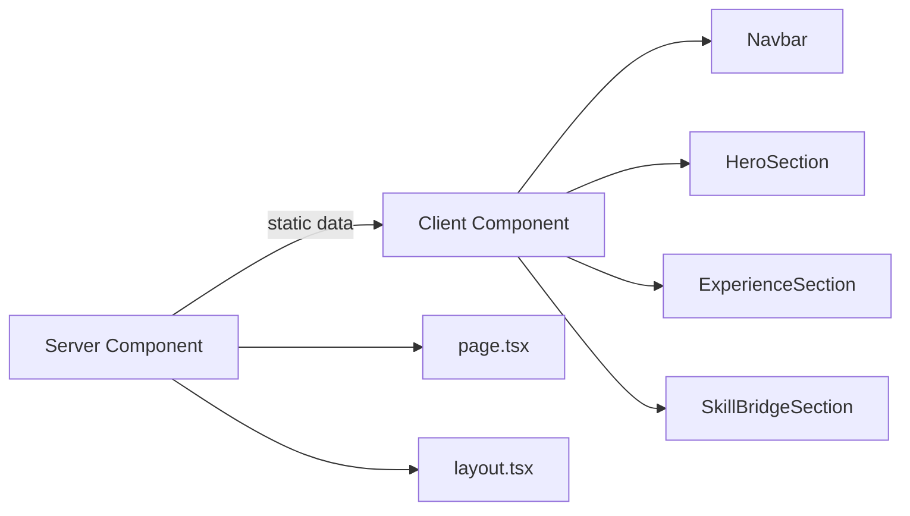

# Design Document: Personal Portfolio Website

## Overview

Website portofolio single-page untuk Rahmat Sigit Hidayat — seorang Data Analyst/Scientist yang bertransisi menjadi Web Developer. Tujuan utama adalah menyampaikan narasi transisi karir secara visual dan interaktif, menarik perhatian rekruter, dan menampilkan kemampuan teknis web development yang sedang dibangun.

Stack yang digunakan:
- **Framework**: Next.js 14+ (App Router, TypeScript)
- **Styling**: Tailwind CSS
- **Animasi**: Framer Motion
- **Deployment target**: Static export (SSG)

Halaman terdiri dari tiga section utama yang di-render dalam satu route (`/`): Hero, Experience, dan Skill Bridge.

---

## Architecture

Aplikasi menggunakan Next.js App Router dengan static generation. Semua konten bersifat statis (tidak ada API call atau database), sehingga halaman di-render sepenuhnya saat build time.



### Rendering Strategy

Karena semua konten statis, `page.tsx` adalah Server Component secara default. Komponen yang membutuhkan interaktivitas atau animasi Framer Motion ditandai `"use client"`.



### Scroll Behavior

Navigasi antar section menggunakan native smooth scroll via CSS `scroll-behavior: smooth` dan `id` anchor pada setiap section. Navbar visibility state dikelola dengan `useScrollPosition` hook.

---

## Components and Interfaces

### Component Tree

```
app/
├── layout.tsx              # Root layout, font, metadata
├── page.tsx                # Home page (Server Component)
└── globals.css             # Tailwind base styles

components/
├── Navbar.tsx              # Sticky navigation bar
├── HeroSection.tsx         # Hero dengan text reveal animation
├── ExperienceSection.tsx   # Grid experience cards
├── ExperienceCard.tsx      # Individual experience card
├── SkillBridgeSection.tsx  # Dua kolom skill badges
└── SkillBadge.tsx          # Individual skill badge

lib/
└── data.ts                 # Static content data (experience, skills)

hooks/
└── useScrollPosition.ts    # Hook untuk deteksi scroll position
```

### Component Interfaces

#### `Navbar`
```typescript
// Tidak menerima props — membaca scroll position dari hook internal
// State: isScrolled (boolean) — menentukan background blur/color
```

#### `HeroSection`
```typescript
// Tidak menerima props — konten dari lib/data.ts
// Animasi: text reveal word-by-word via Framer Motion variants
// Respects prefers-reduced-motion via useReducedMotion()
```

#### `ExperienceSection`
```typescript
// Tidak menerima props — render ExperienceCard dari data.experiences
```

#### `ExperienceCard`
```typescript
interface ExperienceCardProps {
  title: string;
  organization: string;
  dateRange: string;
  description: string;
  type: "work" | "education";
}
// Animasi: whileInView scale + fade, once: true
// Hover: border highlight via Tailwind + Framer Motion whileHover
```

#### `SkillBridgeSection`
```typescript
// Tidak menerima props — render SkillBadge dari data.skills
// Animasi: staggered via Framer Motion container + children variants
// Respects prefers-reduced-motion via useReducedMotion()
```

#### `SkillBadge`
```typescript
interface SkillBadgeProps {
  name: string;
  category: "existing" | "new";
}
```

---

## Data Models

Semua konten disimpan sebagai konstanta TypeScript di `lib/data.ts`. Tidak ada database atau API.

```typescript
// lib/data.ts

export interface Experience {
  id: string;
  title: string;
  organization: string;
  dateRange: string;
  description: string;
  type: "work" | "education";
  order: number; // untuk sorting reverse-chronological
}

export interface Skill {
  name: string;
  category: "existing" | "new";
  order: number; // untuk stagger sequence
}

export const experiences: Experience[] = [
  {
    id: "bi-marketing",
    title: "Junior Business Intelligence",
    organization: "Marketing Agency",
    dateRange: "Nov 2025 – Mar 2026",
    description: "...",
    type: "work",
    order: 1,
  },
  {
    id: "freelance-da",
    title: "Freelance Data Analyst",
    organization: "Independent",
    dateRange: "...",
    description: "...",
    type: "work",
    order: 2,
  },
  {
    id: "kuanta-intern",
    title: "Intern",
    organization: "Kuanta Indonesia",
    dateRange: "...",
    description: "...",
    type: "work",
    order: 3,
  },
  {
    id: "ta-telkom",
    title: "Teaching Assistant",
    organization: "Telkom University",
    dateRange: "...",
    description: "...",
    type: "work",
    order: 4,
  },
  {
    id: "bachelor-telkom",
    title: "Bachelor of Data Science",
    organization: "Telkom University",
    dateRange: "2021–2025",
    description: "GPA 3.96, Summa Cum Laude",
    type: "education",
    order: 5,
  },
];

export const skills: Skill[] = [
  // Existing Skills (order 1-9)
  { name: "Python", category: "existing", order: 1 },
  { name: "Pandas", category: "existing", order: 2 },
  { name: "NumPy", category: "existing", order: 3 },
  { name: "SQL", category: "existing", order: 4 },
  { name: "Tableau", category: "existing", order: 5 },
  { name: "Looker Studio", category: "existing", order: 6 },
  { name: "Power Query", category: "existing", order: 7 },
  { name: "Machine Learning", category: "existing", order: 8 },
  { name: "Data Visualization", category: "existing", order: 9 },
  // New Tech Stack (order 10-14)
  { name: "Next.js", category: "new", order: 10 },
  { name: "React", category: "new", order: 11 },
  { name: "TypeScript", category: "new", order: 12 },
  { name: "Tailwind CSS", category: "new", order: 13 },
  { name: "Framer Motion", category: "new", order: 14 },
];
```

### Animation Configuration

```typescript
// Framer Motion variants yang digunakan lintas komponen

export const textRevealVariants = {
  hidden: { opacity: 0, y: 20 },
  visible: (i: number) => ({
    opacity: 1,
    y: 0,
    transition: { delay: i * 0.1, duration: 0.5 },
  }),
};

export const cardVariants = {
  hidden: { opacity: 0, scale: 0.95 },
  visible: { opacity: 1, scale: 1, transition: { duration: 0.4 } },
};

export const staggerContainer = {
  hidden: {},
  visible: { transition: { staggerChildren: 0.1 } }, // 100ms default, range 80-120ms
};

export const badgeVariants = {
  hidden: { opacity: 0, y: 10 },
  visible: { opacity: 1, y: 0, transition: { duration: 0.3 } },
};
```

---


## Correctness Properties

*A property is a characteristic or behavior that should hold true across all valid executions of a system — essentially, a formal statement about what the system should do. Properties serve as the bridge between human-readable specifications and machine-verifiable correctness guarantees.*

### Property 1: Animation Completion Time Bound

*For any* valid headline text split into N words, the computed total animation duration (last word delay + animation duration) SHALL be less than or equal to 2000ms.

**Validates: Requirements 1.4**

---

### Property 2: Reduced Motion Disables Animations

*For any* animated component (HeroSection, SkillBridgeSection) in the portfolio, when `useReducedMotion()` returns `true`, the component SHALL render its content with animation variants set to their final visible state (no motion applied).

**Validates: Requirements 1.6, 3.6**

---

### Property 3: Experience Cards Count and Order

*For any* valid `experiences` array, the ExperienceSection SHALL render exactly `experiences.length` cards, and the rendered order SHALL match the reverse-chronological `order` field of each entry.

**Validates: Requirements 2.1**

---

### Property 4: Experience Card Displays All Required Fields

*For any* `Experience` object, the rendered `ExperienceCard` SHALL contain the `title`, `organization`, `dateRange`, and `description` fields in its output.

**Validates: Requirements 2.2**

---

### Property 5: Experience Card Animation Variants

*For any* `ExperienceCard` component, the Framer Motion `initial` variant SHALL have `opacity: 0` and `scale: 0.95`, and the `animate`/`whileInView` variant SHALL have `opacity: 1` and `scale: 1`.

**Validates: Requirements 2.3**

---

### Property 6: Experience Card Hover Transition Duration

*For any* `ExperienceCard` component, the hover transition duration SHALL be less than or equal to 150ms.

**Validates: Requirements 2.4**

---

### Property 7: Experience Card Animation Plays Once

*For any* `ExperienceCard` component using `whileInView`, the `viewport` prop SHALL include `once: true` so the animation does not replay on scroll-up.

**Validates: Requirements 2.5**

---

### Property 8: Stagger Delay Within Bounds

*For any* `SkillBridgeSection` stagger container, the `staggerChildren` value in the Framer Motion container variant SHALL be between 0.08 and 0.12 seconds (80ms–120ms).

**Validates: Requirements 3.4**

---

### Property 9: Existing Skills Animate Before New Tech Stack

*For any* `Skill` in the `skills` array, all skills with `category: "existing"` SHALL have an `order` value strictly less than all skills with `category: "new"`, ensuring existing badges animate before new tech stack badges.

**Validates: Requirements 3.5**

---

### Property 10: Navbar Background Applied on Scroll

*For any* scroll position greater than 0px (past the top of the Hero section), the `Navbar` component SHALL apply a background color or backdrop-blur CSS class that is not applied when scroll position is 0.

**Validates: Requirements 4.4**

---

### Property 11: All Images Have Non-Empty Alt Text

*For any* `` or Next.js `<Image>` element rendered in the portfolio, the `alt` attribute SHALL be a non-empty string.

**Validates: Requirements 5.5**

---

## Error Handling

Karena website ini sepenuhnya statis dan tidak ada API call atau user input yang kompleks, error handling berfokus pada:

### Missing or Malformed Data
- `lib/data.ts` menggunakan TypeScript interfaces — type errors akan tertangkap saat compile time.
- Jika field `description` kosong, `ExperienceCard` tetap render tanpa crash (optional field dengan fallback empty string).

### Animation Failures
- Framer Motion gagal load: konten tetap visible karena initial state menggunakan CSS fallback.
- `useReducedMotion()` mengembalikan `null` pada SSR — komponen harus handle dengan `?? false` untuk default ke animasi aktif.

### Scroll Behavior
- Browser yang tidak support `scroll-behavior: smooth` akan fallback ke instant scroll — konten tetap accessible.
- `useScrollPosition` hook menggunakan `window.scrollY` yang tersedia di semua modern browsers; pada SSR, hook mengembalikan `0` sebagai default.

### Responsive Layout
- Tailwind CSS menggunakan mobile-first breakpoints — jika breakpoint tidak dikenali, layout default ke mobile (single column), yang merupakan fallback yang aman.

---

## Testing Strategy

### Dual Testing Approach

Testing menggunakan dua pendekatan komplementer:
- **Unit tests**: Verifikasi contoh spesifik, edge cases, dan struktur komponen
- **Property-based tests**: Verifikasi properti universal yang berlaku untuk semua input

### Unit Testing

Framework: **Vitest** + **React Testing Library**

Unit tests fokus pada:
- Rendering konten yang benar (headline, sub-headline, experience cards, skill badges)
- Struktur HTML semantik (`<header>`, `<main>`, `<section>`, `<nav>`, `<article>`)
- Responsive CSS classes pada grid container
- Navbar link targets dan anchor hrefs
- Static generation (tidak ada `getServerSideProps`)

Contoh unit tests:
```typescript
// HeroSection renders headline and sub-headline
it("renders career transition headline", () => {
  render(<HeroSection />);
  expect(screen.getByRole("heading", { level: 1 })).toBeInTheDocument();
});

// ExperienceSection renders correct number of cards
it("renders all 5 experience entries", () => {
  render(<ExperienceSection />);
  expect(screen.getAllByRole("article")).toHaveLength(5);
});

// SkillBridgeSection renders both groups
it("renders existing skills and new tech stack groups", () => {
  render(<SkillBridgeSection />);
  expect(screen.getByText("Existing Skills")).toBeInTheDocument();
  expect(screen.getByText("New Tech Stack")).toBeInTheDocument();
});
```

### Property-Based Testing

Framework: **fast-check** (TypeScript-native PBT library)

Setiap property test dikonfigurasi dengan minimum **100 iterasi**.

Setiap test diberi tag komentar dengan format:
`// Feature: personal-portfolio-website, Property {N}: {property_text}`

#### Property Test Implementations

**Property 1 — Animation Completion Time Bound**
```typescript
// Feature: personal-portfolio-website, Property 1: Animation completion time bound
fc.assert(fc.property(
  fc.array(fc.string({ minLength: 1 }), { minLength: 1, maxLength: 50 }),
  (words) => {
    const lastDelay = (words.length - 1) * 0.1;
    const animDuration = 0.5;
    return (lastDelay + animDuration) * 1000 <= 2000;
  }
), { numRuns: 100 });
```

**Property 2 — Reduced Motion Disables Animations**
```typescript
// Feature: personal-portfolio-website, Property 2: Reduced motion disables animations
// Mock useReducedMotion() = true, verify components render without motion variants
```

**Property 3 — Experience Cards Count and Order**
```typescript
// Feature: personal-portfolio-website, Property 3: Experience cards count and order
fc.assert(fc.property(
  fc.array(experienceArbitrary, { minLength: 1, maxLength: 20 }),
  (experiences) => {
    const sorted = [...experiences].sort((a, b) => a.order - b.order);
    const rendered = renderExperienceSection(sorted);
    return rendered.cards.length === experiences.length;
  }
), { numRuns: 100 });
```

**Property 4 — Experience Card Displays All Required Fields**
```typescript
// Feature: personal-portfolio-website, Property 4: Experience card displays all required fields
fc.assert(fc.property(
  experienceArbitrary,
  (exp) => {
    const { getByText } = render(<ExperienceCard {...exp} />);
    return (
      !!getByText(exp.title) &&
      !!getByText(exp.organization) &&
      !!getByText(exp.dateRange) &&
      !!getByText(exp.description)
    );
  }
), { numRuns: 100 });
```

**Property 5 — Experience Card Animation Variants**
```typescript
// Feature: personal-portfolio-website, Property 5: Experience card animation variants
// Verify cardVariants.hidden = { opacity: 0, scale: 0.95 }
// Verify cardVariants.visible = { opacity: 1, scale: 1 }
```

**Property 6 — Experience Card Hover Transition Duration**
```typescript
// Feature: personal-portfolio-website, Property 6: Experience card hover transition <= 150ms
// Verify whileHover transition.duration * 1000 <= 150
```

**Property 7 — Experience Card Animation Plays Once**
```typescript
// Feature: personal-portfolio-website, Property 7: Experience card animation plays once
// Verify all ExperienceCard instances use viewport={{ once: true }}
```

**Property 8 — Stagger Delay Within Bounds**
```typescript
// Feature: personal-portfolio-website, Property 8: Stagger delay within 80-120ms
// Verify staggerContainer.visible.transition.staggerChildren >= 0.08 && <= 0.12
```

**Property 9 — Existing Skills Animate Before New Tech Stack**
```typescript
// Feature: personal-portfolio-website, Property 9: Existing skills order < new tech stack order
fc.assert(fc.property(
  fc.constant(skills),
  (skills) => {
    const existingOrders = skills.filter(s => s.category === "existing").map(s => s.order);
    const newOrders = skills.filter(s => s.category === "new").map(s => s.order);
    return Math.max(...existingOrders) < Math.min(...newOrders);
  }
), { numRuns: 100 });
```

**Property 10 — Navbar Background Applied on Scroll**
```typescript
// Feature: personal-portfolio-website, Property 10: Navbar background on scroll
fc.assert(fc.property(
  fc.integer({ min: 1, max: 10000 }),
  (scrollY) => {
    const { container } = renderNavbar({ scrollY });
    return container.querySelector("nav")?.classList.contains("bg-") ?? false;
  }
), { numRuns: 100 });
```

**Property 11 — All Images Have Non-Empty Alt Text**
```typescript
// Feature: personal-portfolio-website, Property 11: All images have non-empty alt text
// Render full page, query all img elements, verify alt !== ""
```

### Testing Balance

- Unit tests: ~15 tests untuk contoh spesifik dan struktur
- Property tests: 11 properties × 100 iterasi = 1100+ test cases
- Bersama-sama memberikan coverage komprehensif tanpa redundansi
